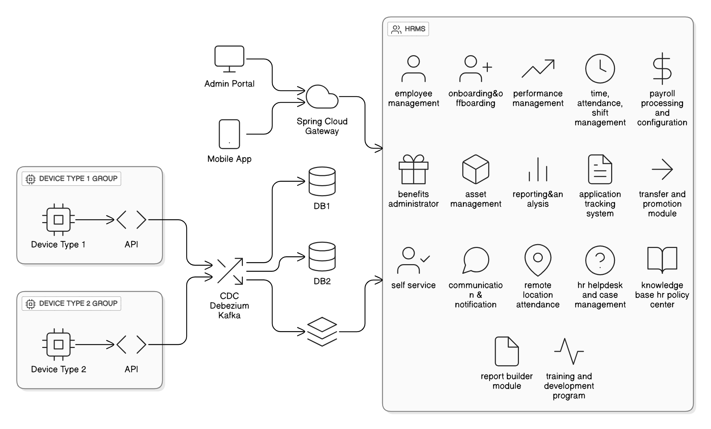
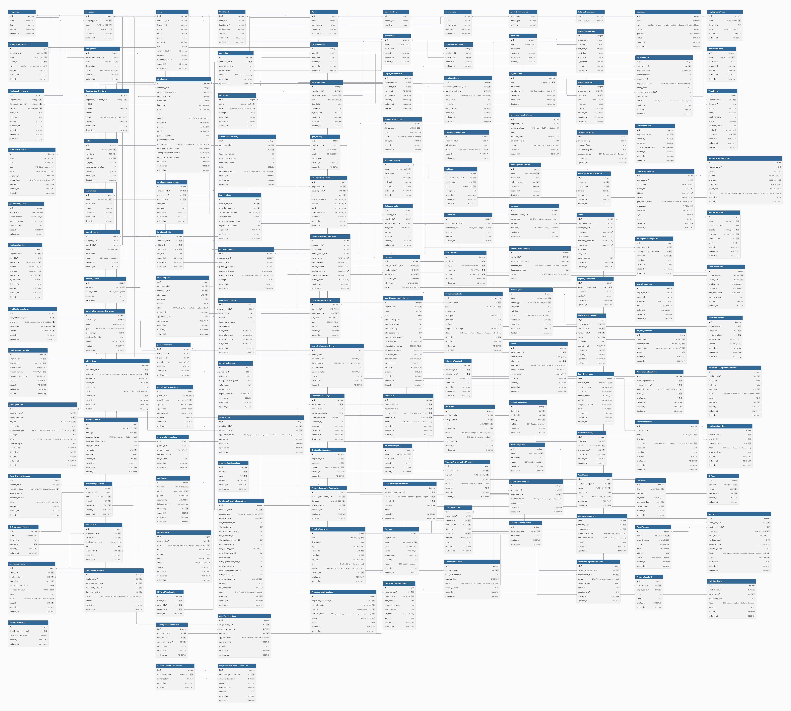
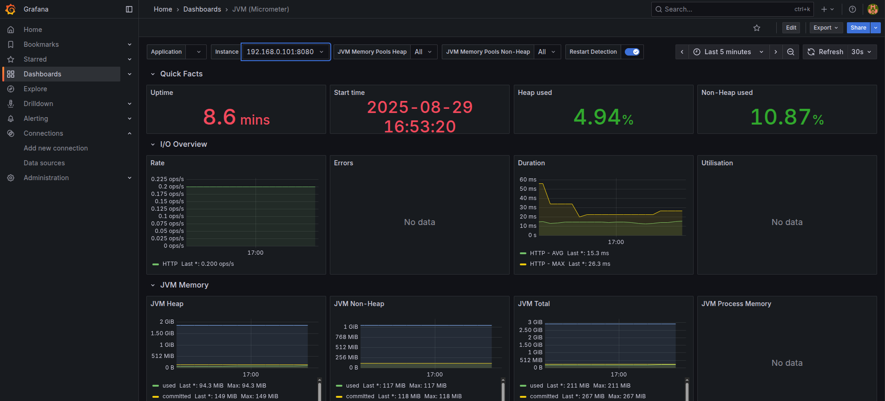
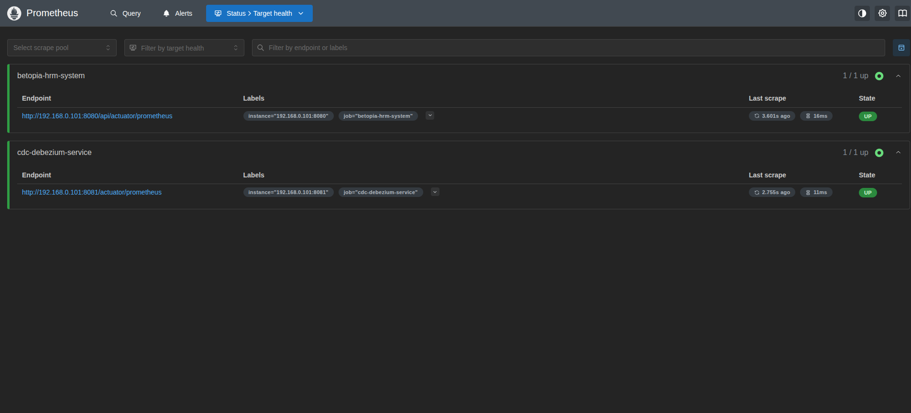

# HRM Application Architecture

# 

# Primary Application Database
    - PostgreSQL

# 
# Modules:
    - Authentication & Authorization
    - User Management
    - Role-Based Access Control (RBAC)
    - Employee Management
    - Attendance Tracking
    - Leave Management
    - Payroll Processing
    - Reporting & Analytics
    - Notification System
    - Onboarding & Offboarding
    - Performance Management
    - Benefits Management
    - Asset Managemnt
    - Transfer and Promotion module
    - self service
    - Renote location attendance
    - Hr helpdesk
    - Training and development
    - Compliance and audit
    - Document management
# CDC (Change Data Capture)

## 📌 What is CDC?
**Change Data Capture (CDC)** is a technique used to identify and capture changes (Insert, Update, Delete) in a database so that these changes can be delivered to downstream systems (e.g., Kafka, Data Warehouse, Analytics systems, or other microservices) in real-time or near real-time.

Simply put, **CDC answers the question: “What changed in my database?”**

---

## 🎯 Why Use CDC?
- **Real-time Data Integration** – Keep multiple databases or systems in sync.
- **Event-driven Systems** – Treat every change as an event and publish it to message brokers like Kafka.
- **Real-time ETL (Extract-Transform-Load)** – Replace batch ETL with continuous streaming pipelines.
- **Microservices Communication** – When one service’s DB changes, other services can react instantly.

---

## ⚡ Approaches to Implement CDC

### 1. Query-based CDC (Polling)
- The application queries the DB periodically to check for changes.
- Example:
  ```sql
  SELECT * FROM attendance_logs WHERE updated_at > last_sync_time;

# Debezium

## 📌 What is Debezium?
[Debezium](https://debezium.io/) is an open-source distributed platform for **Change Data Capture (CDC)**.  
It monitors databases and captures row-level changes (insert, update, delete) in real-time and streams them to Apache Kafka (or other supported systems).

Debezium enables applications to respond instantly to changes in your data, making it ideal for **event-driven architectures, microservices, and real-time analytics**.

---

## 🎯 Why Use Debezium?
- **Real-time Data Streaming** – Get notified whenever data changes in your database.
- **Event-driven Applications** – Turn database changes into Kafka events.
- **Data Replication** – Sync across heterogeneous databases.
- **Analytics & ETL** – Build real-time data pipelines for analytics or data warehouses.
- **Minimal Impact** – Works by reading database transaction logs (binlog/WAL), so no changes to your application code are required.

---

## ⚡ Supported Databases
Debezium supports log-based CDC for many popular databases:

- **Relational Databases**
    - MySQL
    - PostgreSQL
    - SQL Server
    - Oracle
    - Db2
- **NoSQL**
    - MongoDB
- **Cloud-native**
    - Google Spanner

---

## 🏗️ Debezium Architecture
```
+-------------+ +-----------+ +---------+ +-------------------+
| Database | -----> | Debezium | -----> | Kafka | -----> | Consumer (App) |
| (MySQL etc.)| | Connector | | Topics | | (Spring Boot etc.)|
+-------------+ +-----------+ +---------+ +-------------------+
```

```
1. **Database** – source of truth (e.g., MySQL, PostgreSQL).
2. **Debezium Connector** – runs in Kafka Connect, reads database transaction logs.
3. **Kafka** – stores captured change events in topics.
4. **Consumers** – applications (e.g., Spring Boot) consume the change events in real-time.

---

## 🔄 Example Change Event
Suppose an insert happens in MySQL:
```sql
INSERT INTO attendance_logs (employee_id, check_in_time)
VALUES ('E1001', NOW());
```

# Deployment on cloud infrastructure (AWS)

- **Compute**: AWS EC2 or AWS ECS for containerized deployment.
- **Database**: Amazon RDS for PostgreSQL.
- **CDC**: Debezium deployed on AWS ECS or EC2, connected to Kafka
- **Messaging**: Amazon MSK (Managed Streaming for Apache Kafka).
- **Storage**: Amazon S3 for backups and logs.

# Application MoniTroing

## Grafana
# 

## Prometheus
# 

